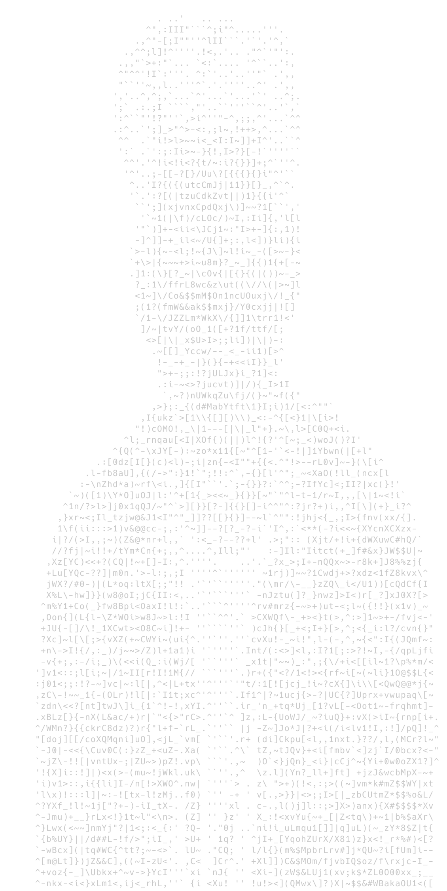

<table align="center">
<tr>
<td width="25%" align="center">



</td>
<td width="75%" valign="top">

```bash
darshan@ml-lab:~$ open case_file.txt
━━━━━━━━━━━━━━━━━━━━━━━━━━━━━━━━━━━━━━━━━━━━━━
CASE ID        : SEN-001
STATUS         : ACTIVE
CLASSIFICATION : MLOps-Engineer and ML educator
NAME           : Darshan V
ALIAS          : TheHashiramaSenju
LOCATION       : India
CURRENT FOCUS  : Applied ML Research & Educating
FUNDING        : Annamalaiyar Foundation
MENTORSHIP     : Tiruchendur Murugan Arakkattalai
FIELD NOTES    :
 > Building    - production-grade ML pipelines
 > Teaching    - practical data science and ML engineering
 > Deploying   - open-source, community-first tools on medical systems
 > Translating - research into real impact
 > Currently   - Learning Distributed ML and Bio-statistics
━━━━━━━━━━━━━━━━━━━━━━━━━━━━━━━━━━━━━━━━━━━━━━
```

</td>
</tr>
</table>

<table align="center">
<tr>
<td width="50%" valign="top">

```bash
darshan@ml-lab:~$ cat active_ops.log
━━━━━━━━━━━━━━━━━━━━━━━━━━━━━━━━━━━━━━
[+] Fetching current R&D threads...

[🧠] INTERESTS
 > Hardware-software BCI
 > Distributed computing
 > Highly scalable systems

[📚] FOCUS AREAS
 > Deep Machine Learning research
 > Adv. Linear Algebra & ODEs

[🔬] EXPLORING
 > Bio-ML research pipelines
 > Adv. RL training methodologies

[🤝] COLLABORATIONS
 > Open to Bio-ML partnerships
 > Deep ML implementation
━━━━━━━━━━━━━━━━━━━━━━━━━━━━━━━━━━━━━━
```

</td>
<td width="50%" valign="top">

```bash
darshan@ml-lab:~$ cat philosophy.txt
━━━━━━━━━━━━━━━━━━━━━━━━━━━━━━━━━━━━━━
[+] DECODING OPERATIONAL ETHOS...

"I am a strong advocate for 
continuous learning. 

While my core focus is data 
science, I actively explore 
adjacent domains. 

Interdisciplinary experience 
is what fuels genuine innovation 
and sharpens problem-solving."

 > ETHOS  : INTERDISCIPLINARY
 > STATUS : EXECUTING
━━━━━━━━━━━━━━━━━━━━━━━━━━━━━━━━━━━━━━
```

</td>
</tr>
</table>

<div align="center">

```bash
darshan@ml-lab:~$ load_modules --toolkit --visual
━━━━━━━━━━━━━━━━━━━━━━━━━━━━━━━━━━━━━━━━━━━━━━━━━━━━━━━━━━━━━━━━━━━━━━━━━━━━━━━━━━━━━━
```

<table align="center">
  <tr>
    <th align="left"><b><code>[💻] Languages</code></b></th>
    <th align="left"><b>Level</b></th>
    <th align="left"><b><code>[🧠] ML & Data Science</code></b></th>
    <th align="left"><b>Level</b></th>
  </tr>
  <tr>
    <td> <b>Python</b></td>
    <td><code>██████████</code>&nbsp;100%</td>
    <td> <b>Scikit-Learn</b></td>
    <td><code>██████████</code>&nbsp;100%</td>
  </tr>
  <tr>
    <td>🗃️ <b>SQL</b></td>
    <td><code>██████████</code>&nbsp;100%</td>
    <td> <b>Pandas</b></td>
    <td><code>██████████</code>&nbsp;100%</td>
  </tr>
  <tr>
    <td> <b>C++</b></td>
    <td><code>█████████░</code>&nbsp;90%</td>
    <td> <b>NumPy</b></td>
    <td><code>██████████</code>&nbsp;100%</td>
  </tr>
  <tr>
    <td> <b>C</b></td>
    <td><code>█████████░</code>&nbsp;90%</td>
    <td> <b>TensorFlow</b></td>
    <td><code>█████████░</code>&nbsp;90%</td>
  </tr>
  <tr>
    <td> <b>CUDA C</b></td>
    <td><code>████████░░</code>&nbsp;80%</td>
    <td> <b>PyTorch</b></td>
    <td><code>█████████░</code>&nbsp;90%</td>
  </tr>
  <tr>
    <td> <b>Rust</b></td>
    <td><code>███████░░░</code>&nbsp;70%</td>
    <td> <b>Streamlit</b></td>
    <td><code>█████████░</code>&nbsp;90%</td>
  </tr>
  <tr>
    <th align="left"><b><code>[🗄️] Databases</code></b></th>
    <th align="left"><b>Level</b></th>
    <th align="left"><b><code>[🛠️] Tools & Platforms</code></b></th>
    <th align="left"><b>Level</b></th>
  </tr>
  <tr>
    <td> <b>MySQL</b></td>
    <td><code>██████████</code>&nbsp;100%</td>
    <td> <b>Git</b></td>
    <td><code>██████████</code>&nbsp;100%</td>
  </tr>
  <tr>
    <td> <b>PostgreSQL</b></td>
    <td><code>█████████░</code>&nbsp;90%</td>
    <td> <b>VS Code</b></td>
    <td><code>██████████</code>&nbsp;100%</td>
  </tr>
  <tr>
    <td> <b>MongoDB</b></td>
    <td><code>████████░░</code>&nbsp;80%</td>
    <td> <b>Docker</b></td>
    <td><code>█████████░</code>&nbsp;90%</td>
  </tr>
  <tr>
    <td></td>
    <td></td>
    <td> <b>Power BI</b></td>
    <td><code>█████████░</code>&nbsp;90%</td>
  </tr>
  <tr>
    <td></td>
    <td></td>
    <td> <b>Apache Superset</b></td>
    <td><code>████████░░</code>&nbsp;80%</td>
  </tr>
  <tr>
    <td></td>
    <td></td>
    <td> <b>Apache Spark</b></td>
    <td><code>████████░░</code>&nbsp;80%</td>
  </tr>
  <tr>
    <td></td>
    <td></td>
    <td> <b>GCP</b></td>
    <td><code>███████░░░</code>&nbsp;70%</td>
  </tr>
</table>

<br>

## Acknowledgements

My research direction and professional growth have been shaped significantly by the guidance of the **Annamalaiyar Foundation** and the **Tiruchendur Murugan Arakkattalai**, whose support makes this work possible.

## Connect With Me

<p align="center">
  <a href="https://www.youtube.com/@tensorvalai"></a>&nbsp;&nbsp;&nbsp;
  <a href="https://medium.com/@thehashiramasenju"></a>&nbsp;&nbsp;&nbsp;
  <a href="https://www.linkedin.com/in/darshanv1/"></a>&nbsp;&nbsp;&nbsp;
  <a href="https://orcid.org/0009-0002-1635-0120"></a>
</p>

</div>