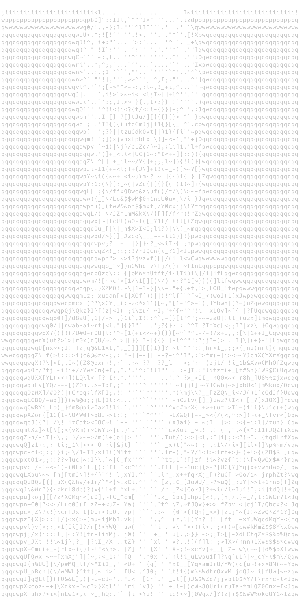

<div align="center">

# Hi, I'm TheHashiramaSenju a.k.a Darshan Venkataramanan 👋

**MLOps Engineer & Machine Learning Educator**

</div>

<table align="center">
<tr>
<td width="38%" align="center">



</td>
<td width="62%">

```bash
darshan@ml-lab:~$ open case_file.txt
━━━━━━━━━━━━━━━━━━━━━━━━━━━━━━━━━━━━━━━━━━━━━━
CASE ID        : SEN-001
STATUS         : ACTIVE
CLASSIFICATION : MLOps-Engineer and ML educator
NAME           : Darshan V
ALIAS          : TheHashiramaSenju
LOCATION       : India
CURRENT FOCUS  : Applied ML Research & Educating
FUNDING        : Annamalaiyar Foundation
MENTORSHIP     : Tiruchendur Murugan Arakkattalai
FIELD NOTES    :
 > Building production-grade ML pipelines
 > Teaching practical data science
 > Deploying open-source, community-first tools
 > Translating research into real impact
━━━━━━━━━━━━━━━━━━━━━━━━━━━━━━━━━━━━━━━━━━━━━━
```

</td>
</tr>
</table>

---

## About Me

I'm a Data Scientist and Machine Learning Educator building practical, production-ready ML systems. My research is funded by the **Annamalaiyar Foundation**, and I work under the mentorship of the **Tiruchendur Murugan Arakkattalai**.

My focus is translating that support into real skill-building within the community — not just publishing papers, but shipping tools people can actually use.

## What I'm Doing

- 🧠 **Interests:** Hardware-software brain integration (BCI), distributed computing, and engineering highly scalable systems.
- 📚 **Focus Areas:** Deepening Machine Learning research, advanced Linear Algebra, and Differential Equations.
- 🔬 **Exploring:** Bio-ML research pipelines and advanced Reinforcement Learning (RL) training methodologies.
- 🤝 **Collaborations:** Open to research partnerships in Bio-ML, Reinforcement Learning, and deep ML implementation.

## Core Toolkit

| Category | Stack |
| :--- | :--- |
| **Languages** |  Python, SQL,  C++,  C,  CUDA C,  Rust |
| **ML & Data Science** |  [Scikit-Learn](https://scikit-learn.org),  Pandas,  NumPy,  TensorFlow,  PyTorch,  Streamlit |
| **Databases** |  MySQL,  PostgreSQL,  MongoDB |
| **Tools & Platforms** |  Docker,  Git,  Power BI,  VS Code,  Apache Superset,  Apache Spark,  GCP |


## Philosophy

I'm a strong advocate for continuous learning. While my core focus is data science, I actively explore adjacent domains — interdisciplinary experience is what fuels genuine innovation and sharpens problem-solving.

## Acknowledgements

My research direction and professional growth have been shaped significantly by the guidance of the **Annamalaiyar Foundation** and the **Tiruchendur Murugan Arakkattalai**, whose support makes this work possible.


<div align="center">

## Connect With Me

<p align="center">
  <a href="https://www.youtube.com/@tensorvalai"></a>&nbsp;&nbsp;&nbsp;
  <a href="https://medium.com/@thehashiramasenju"></a>&nbsp;&nbsp;&nbsp;
  <a href="https://www.linkedin.com/in/darshanv1/"></a>&nbsp;&nbsp;&nbsp;
  <a href="https://orcid.org/0009-0002-1635-0120"></a>
</p>

</div>
